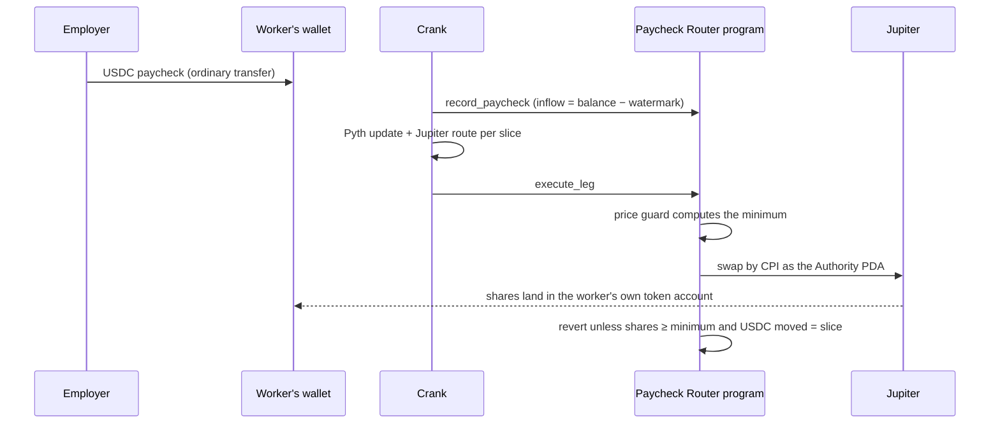

# Paycheck Router

Paycheck Router turns a slice of every USDC paycheck into US stocks the moment it lands, in your own wallet, at a Pyth-checked price.

**Result (fork, Sep 25, 2026):** a $1,850 USDC paycheck from an employer wallet was detected 1.5 s after it landed and recorded onchain, with $370 invested across four slices. The Anthropic slice bought and verified (0.40% over its signed PreStocks mark, 1.62% all-in). The OpenAI slice waited because it traded 30.4% over its mark. The SPYx and NVDAx slices waited because our Pyth API key lacks the US equities grant, and the program never buys without a verified price. Numbers from [`submission-facts.json`](submission-facts.json) and [`evidence/stocklana-fork/`](evidence/stocklana-fork).

Runs on a Surfpool fork of mainnet until the mainnet deploy: the real xStocks, PreStocks, Jupiter and Pyth programs and prices, no real funds.

| | |
| --- | --- |
| Program | `PayEFo1ZAPXKf5H4DoqrsEceYzdSvXJBAGBD7AMQY6H` (deployed on forks only) |
| Verifiable build | `solana-verify` executable hash `8412a60497cf829c1ef238662b69b400373625d4e5052404b9b8edeba8e68cc4`, the binary the canonical run deployed; reproduced by the [`stocklana-submission` release](https://github.com/winsznx/paycheck-router/releases/tag/stocklana-submission) ([build run](https://github.com/winsznx/paycheck-router/actions/runs/36175589252)) |
| Canonical fork run | [`evidence/stocklana-fork/`](evidence/stocklana-fork), fork start slot 450381805; re-check it with `pnpm verify:bundle evidence/stocklana-fork` |
| Replay it | `pnpm demo:fork` ([Run it yourself](#run-it-yourself)) |
| Site, proof page, videos | Links added as they're published |

## The problem

People paid in USDC on Solana have no equivalent of brokerage direct deposit. Deel pays salary stablecoins on Solana ([TheStreet](https://www.thestreet.com/crypto/markets/deel-launches-stablecoin-salary-payouts-via-solana)). More than half of worker withdrawals are taken in stablecoins ([Spark](https://www.spark.money/research/stablecoin-payroll-direct-deposit)). Payroll platforms offer three options for that money: hold, convert or spend. Buying US stocks means a local broker, a CEX at 2% per trade ([Mariblock](https://www.mariblock.com/stories/luno-expands-access-to-tokenized-us-stocks-to-nigeria)), or swapping by hand every payday with no protection against off-hours prices. On Sep 25, 2026, OpenAI PreStocks traded 32.8% over its mark. More in [docs/THESIS.md](docs/THESIS.md).

## How it works



1. The worker picks a split once, for example 20% of every paycheck across SPYx, NVDAx, Anthropic and OpenAI. One setup transaction creates the router and gives its Authority PDA a capped SPL allowance on the worker's USDC. Nothing leaves the wallet.
2. When pay lands, a permissionless crank records the paycheck onchain and prices every slice.
3. Each slice is its own transaction. The program takes a 0.20% fee, invokes Jupiter as the Authority PDA, and reverts unless the shares that land in the worker's wallet reach a minimum it computes itself.
4. A slice that can't buy inside its band waits with a named reason and expires with the USDC untouched. One `revoke` cuts everything off.

## Why Solana

Payroll stablecoins and about 95% of onchain equity volume settle on the same chain, so paycheck to shares is one hop. A $20 slice only makes sense at sub-cent fees. xStocks carry dividends and splits in Token-2022's Scaled UI multiplier, which the program reads when it computes the minimum. The shares are ordinary tokens the worker can sell, borrow against or move.

## The guard

For a listed stock the program requires at least

```text
minOut = floor( U · u · 10^d / ( 10^6 · P · (1 + b/10^4) · m ) )
```

shares, where U is the USDC swapped, u the Pyth USDC/USD price, P the Pyth price per share, b the band in basis points, m the effective Scaled UI multiplier and d the token decimals. Every Pyth price is a posted `PriceUpdateV2` with full Wormhole verification, no older than 30 seconds, with confidence inside 50 bps. Pre-IPO slices use an Ed25519-signed PreStocks mark instead, verified through the instruction right before `execute_prestock_leg`. [`packages/guard-math`](packages/guard-math) is an independent TypeScript version that must match the program on every golden vector in [`tests/vectors/guard.json`](tests/vectors/guard.json).

## How PreStocks and Pyth are used

- **PreStocks:** pre-IPO slices (OpenAI, Anthropic, Anduril, Figure AI, Kalshi, Polymarket, Neuralink) from every paycheck, guarded against the PreStocks mark, which the program adjusts for the token's Scaled UI multiplier. The issuer's Token-2022 transfer fee is read onchain and reported as a separate cost. Tokens in an IPO conversion window convert automatically through a conversion authority that can only move that one token into its target.
- **Pyth:** every automatic xStock buy is gated onchain by a fully verified Pyth price, and every executed slice is re-checked against Hermes price history by an independent verifier. USDC/USD is checked on every buy.

## Proof

Every executed slice has a public record: the Pyth feed and publish time (or the attested mark), the computed minimum, the delivered amount, fees and the verifier result. The verifier CLI re-derives all of it from raw artifacts:

```bash
pnpm verify:bundle evidence/stocklana-fork
```

It recomputes every hash, the minimum, the fees and the premium from the recorded Jupiter builds, Hermes updates, attestations and transactions, and prints PASS or FAIL per slice. Changing one unit of one recorded amount makes it fail. It needs no API keys. (It'll be on npm as `@paycheck-router/verify` once the npm organisation exists.)

The evaluation plan, with its decision rules fixed before any run, is in [docs/EVAL_CAMPAIGN.md](docs/EVAL_CAMPAIGN.md). Results, failures included, are in [docs/GATES.md](docs/GATES.md).

## Architecture

The Anchor program is the only component that can move money. A Cloudflare Worker (Hono, Durable Objects, Queues) detects inflows, prices and routes slices through `packages/sdk`, and verifies them. A Next.js app on Cloudflare shows the router, paychecks and proofs. Details in [docs/ARCHITECTURE.md](docs/ARCHITECTURE.md).

| Path | What |
| --- | --- |
| `programs/paycheck_router` | Anchor program: 21 instructions, 12 invariants as named tests, proptest fuzzing |
| `packages/sdk` | Detection, the leg pipeline, Pyth posts, PreStocks attestations, the verifier, the generated client |
| `packages/guard-math`, `packages/verify` | Reference model of the guard and the verifier CLI |
| `apps/core` | API, Durable Objects, queues and crons on Cloudflare Workers |
| `apps/web`, `packages/ui` | Site, app and proof pages; design system |
| `evidence/` | Run manifests and raw artifacts, failures included |

## Trust model

No key the protocol holds can move a worker's money anywhere except into shares in that worker's own wallet, at a checked price, up to the worker's limits. The crank can only choose when to buy inside the band. Details in [docs/SECURITY.md](docs/SECURITY.md).

## Run it yourself

Requirements: Node 22+, pnpm 11, Surfpool 1.5, the Solana CLI, and a Pyth API key from Pyth Terminal (with the US equities grant, or the xStock slices will wait with PRICE_UNAVAILABLE). A Helius key is optional and avoids the public RPC's rate limits; a Jupiter key is optional.

```bash
pnpm install --frozen-lockfile
export PYTH_API_KEY=... HELIUS_API_KEY=...   # Helius optional
export PROGRAM_SO=path/to/paycheck_router.so     # from the stocklana-submission release
pnpm demo:fork
```

`demo:fork` starts a fresh Surfpool fork of mainnet, deploys the program under its production ID, initializes it, funds fork-only keys by cheatcode, creates a router, sends a paycheck from an employer wallet, detects it, runs every slice to Verified or a named wait, and writes the bundle to `evidence/`. Tests: `pnpm test` (TypeScript), `pnpm test:fork` (fork suites), `cargo test -p paycheck_router` (program), `pnpm verify:campaign` (campaign numbers from raw artifacts). Full setup in [docs/SETUP.md](docs/SETUP.md).

## Limitations

- Every run so far is on a Surfpool fork of mainnet. Balances come from cheatcodes, nothing appears on a mainnet explorer, and there's no congestion or competing flow, so speed isn't claimed.
- Fork routes exclude proprietary AMMs whose quote state an off-chain updater maintains on mainnet only, so fork fills can be slightly worse than mainnet fills.
- On a fork there is no second RPC provider. Verified means the fork readback matches the event and each Pyth price matches Hermes history.
- The PreStocks mark comes from the PreStocks API through our attester key. The program bounds what a wrong mark can do, but it's still a trust assumption.
- Every decision where reality differed from the plan is in [docs/DECISIONS.md](docs/DECISIONS.md).

## How could this result be misleading?

- **Small sample.** One day on a fork is one day of market conditions. Every slice is published with raw data so you can judge it.
- **Team-funded paychecks.** Every paycheck in the evidence was sent from a team-controlled employer wallet on a fork, and is labelled that way.
- **Fork, not mainnet.** Real programs, pools and prices, but no real money, no competing transactions and no network conditions.
- **Point-in-time premiums.** The OpenAI wait depends on the premium at the moment of the run.
- **One executed slice in the canonical run.** Only the Anthropic slice bought; the xStock slices waited on a missing data entitlement, not on the program. The fork suites and the campaign cover more cases, and each is labelled.

## Licence

[Apache-2.0](LICENSE)
