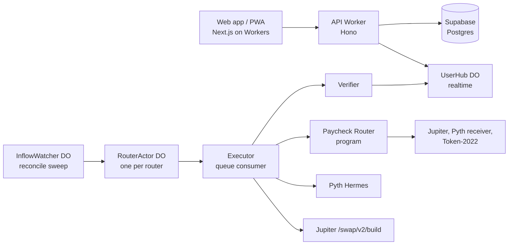
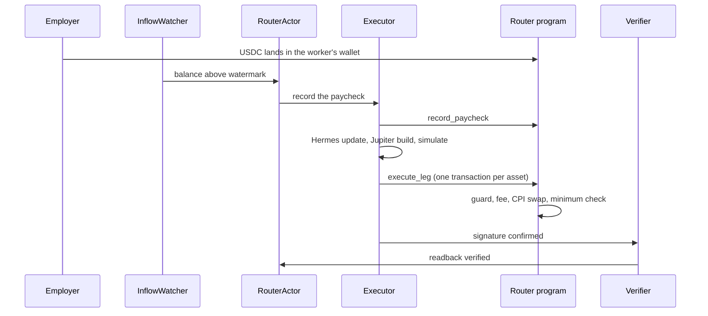
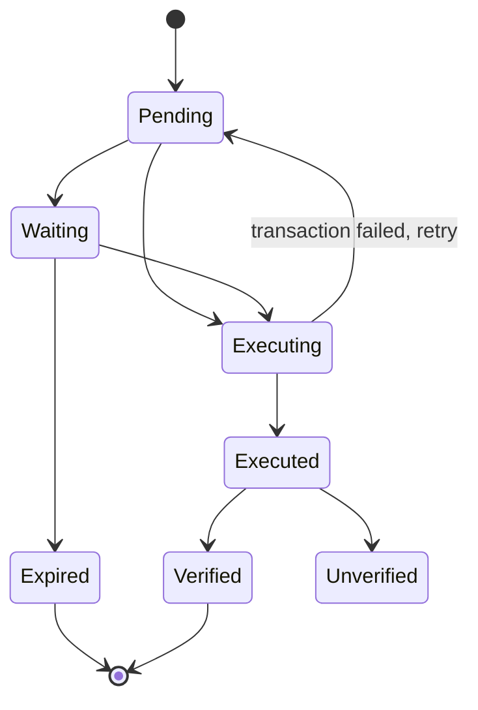

# Architecture

Only the onchain program can move money, and it only moves a worker's USDC into shares delivered to that same worker's wallet. Everything offchain detects, prices, builds and reports.



| Component | Where | Does | Can move funds? |
| --- | --- | --- | --- |
| `programs/paycheck_router` | Solana (a Surfpool fork until the mainnet deploy) | Holds each worker's rules, records paychecks, enforces the price guard, swaps by CPI | Only USDC from the owner's account into shares for the owner |
| `apps/web` | Next.js on Cloudflare Workers | Site, app, proof pages | No |
| `apps/core` | Hono on Cloudflare Workers | Auth, reads, unsigned transaction builders, realtime | No, it builds unsigned transactions |
| InflowWatcher DO | Durable Object | Finds new USDC in watched pay-in accounts (Helius webhooks on mainnet; a 2-second reconcile sweep on forks) | No |
| RouterActor DO | Durable Object, one per router | Serialises a router's lifecycle, one transaction in flight | No |
| Executor | Queue consumer running `packages/sdk` | Pyth refresh, Jupiter build, simulate, send, confirm | Signs as fee payer only |
| Verifier | Queue consumer; also `packages/verify` as a CLI | Independent readback and recomputation | No |

## Accounts

| Account | Seeds | Purpose |
| --- | --- | --- |
| Config | `["config"]` | Global settings inside compiled hard caps |
| Asset | `["asset", mint]` | One per tradable token: Pyth feeds, bands, status, conversion terms |
| Router | `["router", owner]` | One per worker: split, rules, USDC watermark, lifetime stats |
| Authority | `["authority", router]` | SPL delegate on the owner's USDC and the Jupiter taker. Holds nothing between instructions |
| Convert authority | `["convert", router, mint]` | Delegate on one pre-IPO token account, used only for that token's IPO conversion |
| Paycheck | `["paycheck", router, seq]` | One per recorded inflow, with one leg per asset |

## A paycheck, end to end



1. **Detect.** The pay-in account's balance rises above the router's watermark. On forks the sweep runs every 2 seconds against the surfnet RPC; on mainnet Helius webhooks push, and the sweep catches anything missed.
2. **Record.** `record_paycheck` takes inflow = balance − watermark, applies the invest share, the daily cap and the per-leg cap, splits by weight, and creates a Paycheck account with one pending leg per asset.
3. **Price.** One Hermes accumulator update covers every feed the pending legs need plus USDC/USD. It is posted with full verification, and the update accounts close in the same flow so rent returns to the crank.
4. **Route.** Jupiter `/swap/v2/build` with the Authority PDA as taker, the owner's token account as destination, the leg's band as slippage, and `maxAccounts=40` so the program's own accounts fit.
5. **Simulate.** A program error ends the attempt as a named wait, and the simulation logs are kept as evidence.
6. **Execute.** `execute_leg` checks the price, takes the fee, moves the slice into the Authority's USDC account, invokes Jupiter with the Authority's PDA signature, then requires the owner's share balance to rise by at least the minimum and the owner's USDC to fall by exactly the slice.
7. **Verify.** A separate reader recomputes the minimum and the premium from the posted Pyth price and compares the event with chain state. On forks it also checks each Pyth price against Hermes history for that feed and publish time.

Each slice is its own transaction, so one slow asset never blocks the others.

## The guard

Buying a listed stock, the program requires the shares delivered to be at least

```text
minOut = floor( U · u · 10^d / ( 10^6 · P · (1 + b/10^4) · m ) )
```

where U is the USDC swapped in base units, u the Pyth USDC/USD price, P the Pyth price per share in USD, b the band in basis points, m the token's effective Scaled UI multiplier and d its decimals. Selling and IPO conversion use the mirror-image formulas. Prices are fixed point at 1e9, the multiplier at 1e12, every step is checked math, and `packages/guard-math` is an independent TypeScript version that must agree with the program to the base unit on every golden vector in `tests/vectors/guard.json`.

For pre-IPO tokens, P is a PreStocks mark signed by the attester key with Ed25519, verified by the program through the instruction right before `execute_prestock_leg`, and no older than 300 seconds.

## Slice states



Waiting always carries a reason: MARKET_CLOSED, PREMIUM_TOO_HIGH, PRICE_UNCERTAIN, USDC_OFF_PEG, ALLOWANCE_LOW, ALLOWANCE_REVOKED, FUNDS_MOVED, ASSET_PAUSED or LANDING. Expired means the USDC never left the wallet.
